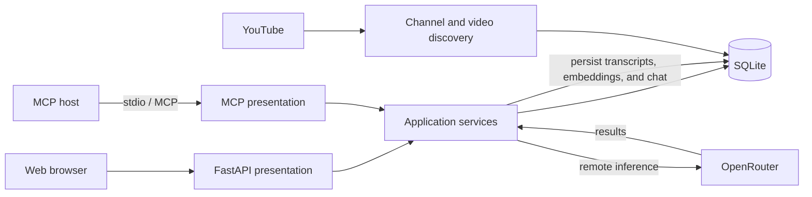

# Video RAG

**Build a searchable library from YouTube channels and ask grounded questions across their videos.**

Video RAG is a local web app and MCP server for discovering channel videos, explicitly approving transcription jobs, and chatting with source-cited transcripts. Application data lives in SQLite; all transcription, embedding, and chat inference runs remotely through OpenRouter.

## Features

- Save YouTube channels and refresh their video catalogs without starting transcription.
- Select videos and approve transcription batches only after reviewing the estimated cost.
- Search transcripts with hybrid BM25 and BGE-M3 retrieval, combined using reciprocal rank fusion (RRF).
- Ask questions with video links, timestamps, citation checks, and abstention when evidence is insufficient.
- Optionally run a faithfulness check or Jev reranking.
- Connect MCP-compatible AI hosts to the same library through a local `stdio` server.

## Architecture



The project uses four layers under `src/rag_app`:

| Layer | Responsibility |
| --- | --- |
| `domain` | Entities, ports, validation, and retrieval calculations. |
| `application` | Catalog, ingestion, retrieval, chat, and background-worker use cases. |
| `adapters` | SQLite, YouTube, OpenRouter, and configuration. |
| `presentation` | FastAPI web/API and the MCP server. |

SQLite stores channel and video metadata, jobs, transcripts, chunks, chat history, and serialized embedding vectors. Retrieval computes BM25 and cosine similarity, then combines their rankings with RRF. There is no separate vector database service or Qdrant dependency.

## Models and cost controls

| Task | Provider/model |
| --- | --- |
| Transcription | `qwen/qwen3-asr-0.6b` via OpenRouter |
| Embeddings | `baai/bge-m3` via OpenRouter |
| Chat and faithfulness checks | `openai/gpt-6-luna`, `reasoning_effort=low` |
| Optional reranking | `typesafe/jev-1.13` via OpenRouter |

There are no local LLM, ASR, embedding, Whisper, or model-weight downloads.

- Channel discovery and refresh never start paid transcription. Transcription requires an explicit selection and approval.
- The default estimated transcription cap is **$0.10 per approved batch**. The fallback estimate is `$0.000003` per audio second; set `RAG_MAX_BATCH_USD` lower if desired. Batches over the cap are rejected before jobs are queued.
- Failed provider calls are not automatically retried. Saved transcripts and embeddings are reused after explicit reapproval.
- Audio is downloaded to a temporary directory, sent to the remote transcription provider, and removed afterward.
- Chat output is capped at 384 tokens. The optional faithfulness check is another model request; the web UI discloses it.
- Jev is off by default and has a `$0.001` estimated per-query cap.
- Cost estimates are estimates. OpenRouter may report actual costs for chat and embeddings; if it does not, the app shows that the cost is unavailable instead of displaying `$0`.

OpenRouter receives the audio, queries, or transcript chunks needed for the requested operation and charges your account. No real provider calls are made by the local test suite or retrieval benchmark.

## Quick start

Requirements: Python 3.10+, GNU Make, and an OpenRouter API key. From the repository root:

```powershell
make setup
Copy-Item .env.example .env
```

Add your key to `.env`:

```dotenv
OPENROUTER_API_KEY=your-openrouter-key
```

Start the web app and API:

```powershell
make serve
```

Open <http://127.0.0.1:8000> for the web app or <http://127.0.0.1:8000/docs> for the interactive API documentation. The server binds to localhost. Stop it with `Ctrl+C`.

The app also accepts the legacy key name `OPENROUTER_APIKEY`. Never commit `.env`.

### Without Make

On Windows PowerShell:

```powershell
py -m venv .venv
.venv\Scripts\python.exe -m pip install -e ".[test]"
Copy-Item .env.example .env
.venv\Scripts\python.exe -m rag_app.presentation.web
```

On macOS or Linux, use `python3 -m venv .venv`, `.venv/bin/python -m pip install -e ".[test]"`, copy `.env.example` to `.env`, and run `.venv/bin/python -m rag_app.presentation.web`.

## Make commands

| Command | Description |
| --- | --- |
| `make setup` | Create `.venv` and install the app and test dependencies. |
| `make serve` | Run the local web app and JSON API at `127.0.0.1:8000`. |
| `make test` | Run the offline unit test suite. |
| `make benchmark` | Run the deterministic retrieval benchmark. |
| `make check` | Run tests and the retrieval benchmark. |

`make setup` uses `py` on Windows and `python3` on macOS/Linux. The other targets use the Python executable inside `.venv`.

## MCP server

The MCP server exposes the same SQLite library and application services to compatible AI hosts. It uses the official Python MCP SDK v2 and local `stdio` transport: the host launches the server as a subprocess, so no network port is opened.

| Tool | Behavior | Provider calls |
| --- | --- | --- |
| `list_channels` | List saved channels and video counts. | None |
| `list_channel_videos` | List videos for a channel. | None |
| `get_video_transcript` | Read a saved transcript, up to 20,000 characters. | None |
| `search_transcripts` | Hybrid search; can be scoped to channel or video IDs. | BGE-M3 query embedding through OpenRouter. |
| `ask_video_library` | Answer with citations and abstain when evidence is insufficient. | BGE-M3 and GPT-6 Luna; optional extra faithfulness request. |

The MCP interface does not expose channel refresh or transcription approval. Faithfulness verification is off by default for MCP chat calls to avoid an additional request. Search and chat results include provider/model and reported cost metadata.

After `make setup`, add a server entry to your MCP host configuration and replace the path with the repository location on your machine:

```json
{
  "mcpServers": {
    "video-rag": {
      "command": "C:\\path\\to\\RAG-App\\.venv\\Scripts\\python.exe",
      "args": ["-m", "rag_app.presentation.mcp_server"]
    }
  }
}
```

The process reads the OpenRouter key from `.env`; do not put secrets in the host configuration. The installed console command is `video-rag-mcp`. MCP host settings differ, so use the equivalent command/arguments format for your host.

This is a local, single-user server with no authentication or user isolation. Any host connected to it can access the local library. Do not expose it to untrusted remote clients as-is.

## Retrieval evaluation

Run the offline benchmark with `make benchmark` or:

```powershell
.venv\Scripts\python.exe -B -m tests.retrieval_benchmark
```

It reports Recall@k, MRR, and nDCG on a small deterministic fixture. These results check ranking mechanics; they are not a measure of semantic quality on a production corpus. For evaluation methodology and the measurement log, see [RAG evaluation](docs/RAG_EVALUATION.md) and [measurements](docs/MEASUREMENTS.md). Production-quality metrics require reviewed query-to-source relevance labels.

## Project structure

```text
src/rag_app/
  domain/
  application/
  adapters/
  presentation/
tests/
docs/
scripts/
```
